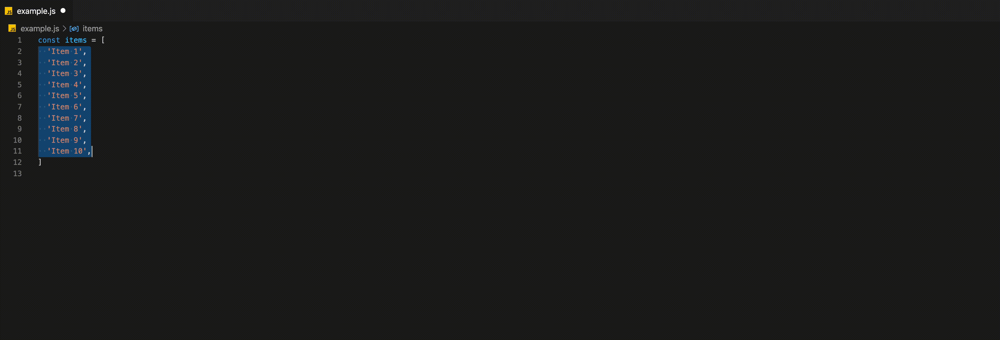

# addnumbertoselection README

Add a specified number to number(s) highlighted within the VS Code editor.

## Features

Add a number to number(s) selected in the VS Code editor. The extension will replace each selection with the sum of `selection + inputNumber`.

Example:
- Highlight multiple numbers in your editor
- Open the Command Pallete (SHIFT + CMD + P)
- Select "Add Number to Selected Number(s)"
- Input a number
- Press enter

**NOTE:** Extension uses typecasting (`var sel = +selection`) to convert selections to numbers for addition.

## Demo

